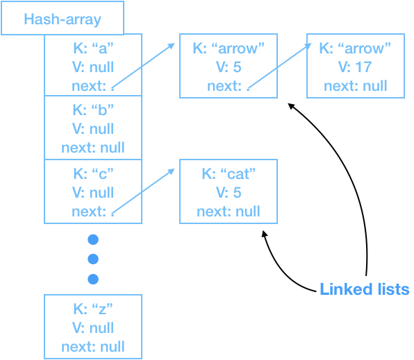

# Dasha Map

* **Objective**
    * To create a HashMap named `DashaMap` without using any class which extends, implements, or uses the built-in `java.util.Collection` interface.
* **Purpose**
    * To gain familiarity the Data Structures and `Collection` framework.
* **Description**
    * Create a `DashaMap` has a composite `MyLinkedList` of `MyNode` of `MyPair`s.




Well, your first `hashing function` is this:

```java
private String HashFunctionOne(String input) {
    if (input.length() > 0) {
        return String.toLowerCase(String.valueOf(input.charAt(0)));
    }
    return nil;
}
```
And since you have a list of words, some of which have the same first letter (character),
you will have *hash collisions* when you insert a second word in the same bucket. That's why you have a
linked list which is attached to the end of the list when you insert/set a word.

And your second hashing function is:

```java
private String HashFunctionTwo(String input) {
    if (input.length() > 0) {
        return String.toLowerCase(String.valueOf(input.charAt(1)));
    }
    return nil;
}
```

and your third hashing function is:

```java
private String HashFunctionThree(String input) {
    if (input.length() > 1) {
        return String.toLowerCase(String.valueOf(input.charAt(0)+input.charAt(1)));
    }
    return nil;
}
```

You'll be writing three different classes, one for each hashing function. Call them `DashaMapOne,
DashaMapTwo, & DashaMapThree`.

Build a test harness that can read in the word list and insert each word into each of the
three hash-maps.

Each of the classes should implement this interface:

```java
interface HashMapX {
   
   // fundamentals
   public void set(String key, String value);
   public String delete(String key);
   public String get(String key);
   public boolean isEmpty();
   public long size();

   // testing access
   protected boolean bucketSize(String key); // used for tests
}
```

When you create the constructor for each class, you need to create an array of `Node`
objects. Each `Node` should look like:

```
Node:
    k: String
    v: Integer
    next: Node
```

the hash-array needs to get initialized to 26 long of Node, with each value being 'a'..'z'.

read in the list of words in `wordlist.txt`. Each word is on it's own line, with a value,
and as each word is read, insert it into each of the three hash-maps, using the word as the key,
and integer value as the value.

When you set a word/value pair: (this is pseudocode)

```
- set(key, value) {
    key-hash = hash-function(key)
    newval = new Node(key, value)
    append-to(hash-array[key-hash], newval)
}
```

`append-to` is a method that attaches the created node with the word as the key, the integer as the value,
at the end of the linked list attached to the hash-array head list-pointer.

When you get a word/value pair:

```
- value get(key) {
    key-hash = hash-function(key)
    newnode = find-in(hash-array[key-hash], key)
    return newnode.v
}
```

`find-in(array-slot, key-word)` returns the Node that contains the key-word in the `k` field.
(you may want to just do a simple linear search to find the node that has the key in it).

and the Hard One is `delete(key-word)`

oy. that's enough.

#### Nota Bene:
If you can figure out a way to make your implmentation GENERIC, you get 2.75million extra points. That's enough to get the level 3 prize, or a very old, tattered, online copy of [Think Data Structures in Java](https://open.umn.edu/opentextbooks/textbooks/think-data-structures-algorithms-and-information-retrieval-in-java)
